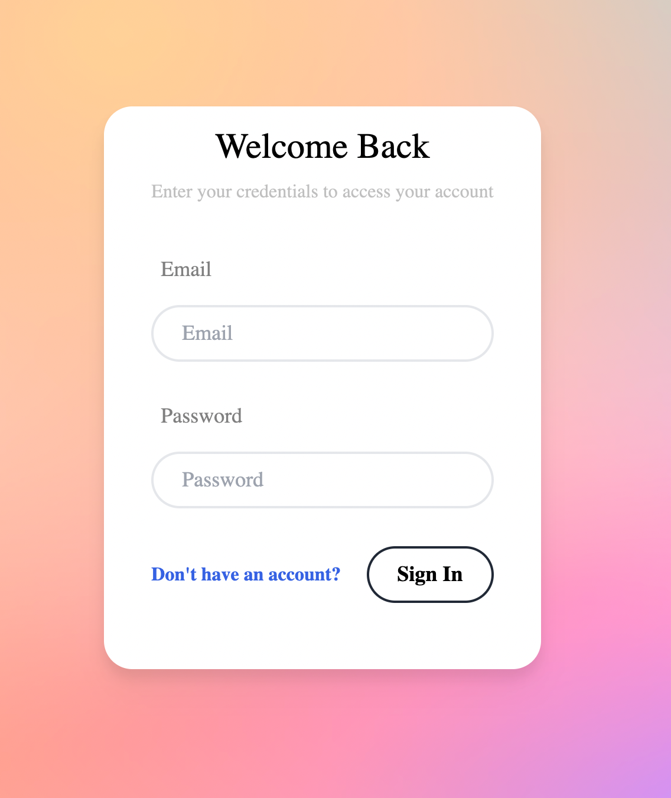
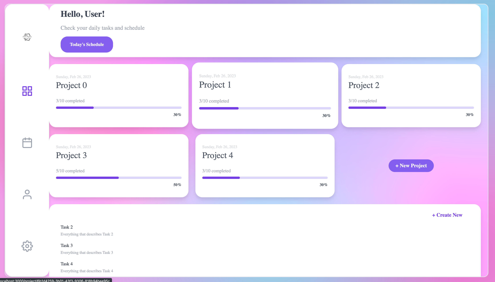
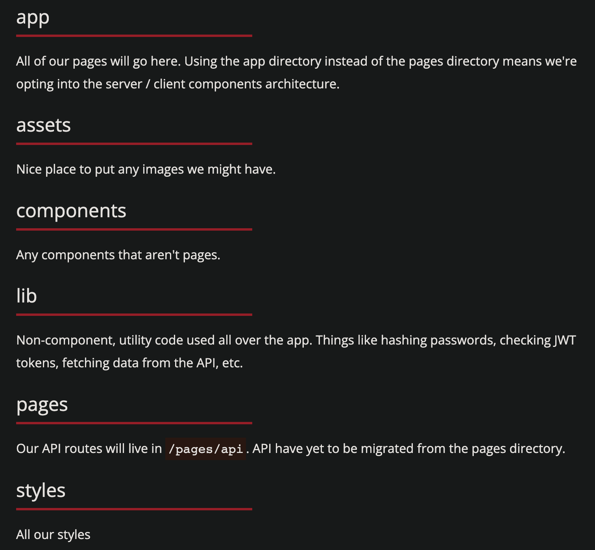

<!-- omit in toc -->
# Time Management Application using NextJS

This is a [Next.js](https://nextjs.org/) project bootstrapped with [`create-next-app`](https://github.com/vercel/next.js/tree/canary/packages/create-next-app).

<!-- omit in toc -->
## Table of Content

- [Application](#application)
- [Getting Started](#getting-started)
- [Learn More](#learn-more)
- [Deploy on Vercel](#deploy-on-vercel)
- [Starting Application](#starting-application)
  - [Prettier](#prettier)
- [Folder Structure](#folder-structure)
- [Database](#database)
  - [Railway](#railway)
  - [Local PSQL](#local-psql)
    - [Starting PSQL server](#starting-psql-server)
    - [Creating PSQL DB](#creating-psql-db)
    - [Listing Databases](#listing-databases)
    - [Switching between Databases](#switching-between-databases)
    - [Deleting Database](#deleting-database)
    - [Tables](#tables)
    - [Connecting to local psql db](#connecting-to-local-psql-db)
  - [Prisma](#prisma)
    - [Schema](#schema)
    - [Migrations](#migrations)
      - [Using Local PSQL Migration](#using-local-psql-migration)
      - [Using Prisma Migration](#using-prisma-migration)
    - [Generate Prisma Client](#generate-prisma-client)
    - [DB Helper Functions](#db-helper-functions)
    - [Seed Script](#seed-script)
      - [Using Local PSQL Seed](#using-local-psql-seed)
      - [Writing Seed Script](#writing-seed-script)
      - [Seeding with Prisma](#seeding-with-prisma)
- [Routes](#routes)

## Application

Time management application using NextJS, Prism, and Auth.




## Getting Started

First, run the development server:

```bash
npm run dev
# or
yarn dev
# or
pnpm dev
```

Open [http://localhost:3000](http://localhost:3000) with your browser to see the result.

You can start editing the page by modifying `app/page.tsx`. The page auto-updates as you edit the file.

[API routes](https://nextjs.org/docs/api-routes/introduction) can be accessed on [http://localhost:3000/api/hello](http://localhost:3000/api/hello). This endpoint can be edited in `pages/api/hello.ts`.

The `pages/api` directory is mapped to `/api/*`. Files in this directory are treated as [API routes](https://nextjs.org/docs/api-routes/introduction) instead of React pages.

This project uses [`next/font`](https://nextjs.org/docs/basic-features/font-optimization) to automatically optimize and load Inter, a custom Google Font.

## Learn More

To learn more about Next.js, take a look at the following resources:

- [Next.js Documentation](https://nextjs.org/docs) - learn about Next.js features and API.
- [Learn Next.js](https://nextjs.org/learn) - an interactive Next.js tutorial.

You can check out [the Next.js GitHub repository](https://github.com/vercel/next.js/) - your feedback and contributions are welcome!

## Deploy on Vercel

The easiest way to deploy your Next.js app is to use the [Vercel Platform](https://vercel.com/new?utm_medium=default-template&filter=next.js&utm_source=create-next-app&utm_campaign=create-next-app-readme) from the creators of Next.js.

Check out our [Next.js deployment documentation](https://nextjs.org/docs/deployment) for more details.

## Starting Application

```bash
npx create-next-app@latest --experimental-app
```

dependencies:

```json
{
  "@prisma/client": "4.6.1",
  "bcrypt": "5.1.0",
  "class-variance-authority": "0.4.0",
  "clsx": "1.2.1",
  "cookie": "0.5.0",
  "css-reset-and-normalize": "2.3.6",
  "jose": "4.11.1",
  "react-feather": "2.0.10"
}
```

The dev dependencies:

```json
{
  "prisma": "4.6.1",
  "tailwindcss": "3.2.4",
  "ts-node": "10.9.1",
  "tsconfig-paths": "4.1.1"
}
```

### Prettier

- [documentation on adding tailwind to prettier](https://github.com/tailwindlabs/prettier-plugin-tailwindcss)
- [Adding import order to prettier](https://github.com/trivago/prettier-plugin-sort-imports)
- to format: `npm run format`

## Folder Structure



## Database

### Railway

The fastest and easiest way to setup a Psql DB if you don't already have one is to use a hosted one.

Checkout [Railway](https://railway.app/) to setup a free one. Either way, you'll need the connection string. Inside your `.env` file, add your DB connection string

```bash
DATABASE_URL="your-connection-string"
```

### Local PSQL

#### Starting PSQL server

Homebrew services plugin makes it easy to manage services that are installed with homebrew

```shell
brew services list
```

To start/stop a PSQL server as a service, run the following command.

```shell
brew services start postgresql
brew services stop postgresql
```

To verify that the server has started or stop, check the list of running services.

```shell
brew services list
```

#### Creating PSQL DB

Interact with Postgres using `psql` environment.

```shell
psql
```

> If this display an error, you may need to create a default database. To do so, enter:
>
> ```shell
> createdb
> ```

Let's create a local time management database. Avoid naming postgres db with capital letter, instead use underscore.

```shell
CREATE DATABASE time_management;
```

We can also create from command line outside of psql environment with:

```shell
createdb time_management;
```

#### Listing Databases

We can verify db creation by listing with `\l` command to list all databases.

#### Switching between Databases

We can switch database with the command `\c`

```shell
\c time_management
```

#### Deleting Database

To delete a database we need to switch out of it first, back to the default; then use `DROP DATABASE` command.

```shell
\c default
DROP DATABASE time_management
```

#### Tables

To display tables in the current connected database run the REPL command,

```shell
\dt
```

To verify that table was created with the correct columns, run the command,

```shell
# no uppercase
\d <table_name>

# If uppercase name
\d "<TableName>"
```

We can view contents in a table

```shell
SELECT * FROM <table_name>
```

#### Connecting to local psql db

By default prisma requires a username and password when connecting to a PostgreSQL database using Prisma

```shell
datasource db {
  provider = "postgresql"
  url      = "postgresql://<username>:<password>@localhost:5432/time_management"
}
```

> Replace `<username>` with the username you want to use (e.g. postgres) >and `<password>` with the password for that user. If you're using an >empty password, you can omit the `:<password>` part of the URL.

### Prisma

Prisma is a database query builder similar to Knex. Basically by using prisma we get our SQL queries automatically generated for us and it is type-safe.

We can then initialize a prisma project with:

```shell
npx prisma init
```

This creates a new project directory in the current directory and adds to the following files:

- `prisma` directory: contains the configuration files for prisma, including the `schema.prisma` file which defines the data models for the database.
- `node_modules` directory: this contains the dependencies required by prisma and the project.
- `package.json` file: this contains the metadata for the project and scripts.

#### Schema

- [Prisma schema documentation](https://www.prisma.io/docs/reference/api-reference/prisma-schema-reference)

Format schema: This command formats the Prisma schema file `schema.prisma` according to Prisma's code style guidelines.

`npx prisma format`

#### Migrations

##### Using Local PSQL Migration

A **migration** is a file that contains SQL commands that are used to recreate the tables in a database on demand.

To migrate the `time_management` database **locally**, run the following command from the shell:

```shell
psql time_management -f migration.sql
```

##### Using Prisma Migration

After creating our schema, we need to do a few things:

1. Sync our DB and schema together
2. Generate a type safe ORM based on our schema so we can interact with the DB

Luckily for us, prisma handles all of this for us. We can use the migrate command. This will create the database tables and columns based on the schema.

`npx prisma migrate dev`

#### Generate Prisma Client

This will generate our prisma client

`npx prisma generate`

When you generate the Prisma client, Prisma takes your Prisma schema and generates a strongly-typed Prisma client that you can use to interact with your database in code.

The methods provided by Prisma client can be grouped into a few catagories:

- CRUD operation in database. For example, `createOne`, `findMany`, `update`, and `delete`.
- Aggregations operation on database. For example, `count`, `sum`, and `average`.
- [client method documentation](https://www.prisma.io/docs/concepts/components/prisma-client/crud)

Prima client is generated based on our schema, so any changes made to the schema will require us to regenerate the client to reflect those changes in code.

#### DB Helper Functions

Because Next API functions run in a serverless environment, we're going to cache our Prisma client and reuse it when possible to avoid having too many connections.

In `/lib/db.ts` add this

```ts
import { PrismaClient } from '@prisma/client'

declare global {
  // eslint-disable-next-line no-var
  var cachedPrisma: PrismaClient
}

let prisma: PrismaClient
if (process.env.NODE_ENV === 'production') {
  prisma = new PrismaClient()
} else {
  if (!global.cachedPrisma) {
    global.cachedPrisma = new PrismaClient()
  }
  prisma = global.cachedPrisma
}

export const db = prisma
```

#### Seed Script

##### Using Local PSQL Seed

A **seed** file contains SQL commands that are used to recreate rows in a table on demand (insert data into the Tables).

```shell
psql time_management -f seed.sql
```

##### Writing Seed Script

All we have to do is write a seed script. A seed script is just a piece of code that inserts fake data into our dev DB so we can use it for development.

Let's create a seed script. Make file in the prisma folder called `seed.ts`

Next, let's adjust our package.json.

```json
{
  "prisma": {
    "seed": "ts-node -P tsconfig-seed.json -r tsconfig-paths/register --transpileOnly prisma/seed.ts"
  }
}
```

##### Seeding with Prisma

Command in the Prisma CLI that allows you to seed (populate) your database with initial data.

```shell
npx prisma db seed
```

By default, Prisma looks for a file named seed.ts in the prisma/ directory. This file should export an async function called seed that contains the data you want to seed.

When you run npx prisma db seed, Prisma will execute the seed function and insert the data into your database.

> Note that you must have already created your database and migrated your schema before running the seed command.

check that data was seeded correctly:

```shell
npx prisma studio
```

> Can also verify by checking your local pSQL database

## Routes

The routes for app will be as follows:

```bash
/register
/signin
/home
/project/[id]
```

we'll use route grouping here. This will allow us to have two root layouts without adding segments to the url.

```bash
(auth)
  layout
  register
    page
  signin
    page
(dashboard)
  layout
  home
    page
  project
    [id]
      page
```
